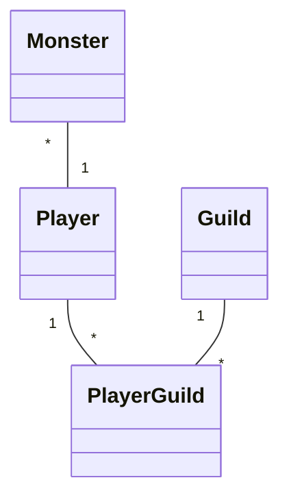

# Project .NET Framework

* Naam: Sam Rotthier
* Studentennummer: 0162653-81
* Academiejaar: 23-24
* Klasgroep: TIFL02
* Onderwerp: Monster *-1 Player \*-\* Guild

---
- Solution name: MedievalMMO
    - Console Application project: CA

## Sprint 3
### Beide zoekcriteria ingevuld
```sql
SELECT "g"."GuildId", "g"."GuildLevel", "g"."GuildMadeBy", "g"."GuildMadeOn", "g"."GuildName"
FROM "Guilds" AS "g"
WHERE (@__upperGuildName_0 = '' OR instr(upper("g"."GuildName"), @__upperGuildName_0) > 0) AND "g"."GuildLevel" = @__guildLevel_Value_1
```

### Enkel zoeken op naam
```sql
SELECT "g"."GuildId", "g"."GuildLevel", "g"."GuildMadeBy", "g"."GuildMadeOn", "g"."GuildName"
FROM "Guilds" AS "g"
WHERE @__upperGuildName_0 = '' OR instr(upper("g"."GuildName"), @__upperGuildName_0) > 0
```

### Enkel zoeken op level
```sql
SELECT "g"."GuildId", "g"."GuildLevel", "g"."GuildMadeBy", "g"."GuildMadeOn", "g"."GuildName"
FROM "Guilds" AS "g"
WHERE "g"."GuildLevel" = @__guildLevel_Value_0
```

### Beide zoekcriteria leeg
```sql
SELECT "g"."GuildId", "g"."GuildLevel", "g"."GuildMadeBy", "g"."GuildMadeOn", "g"."GuildName"
FROM "Guilds" AS "g"
```

## Sprint 4



## Sprint 6

### Nieuwe publisher

#### Request
```
POST https://localhost:7050/api/Monsters HTTP/1.1
Accept: application/json
Content-Type: application/json

{"MonsterName": "Kalimero", "MonsterGender":  0, "MonsterLevel":  80, "MonsterHealth":  10.5, "MonsterCanEvolve":  false}
```

#### Response
```
{
  "monsterId": 6,
  "monsterName": "Kalimero",
  "monsterGender": 0,
  "monsterLevel": 80,
  "monsterHealth": 10.5,
  "monsterCanEvolve": false,
  "ownedByPlayer": null
}
Response file saved.
> 2024-08-14T224644.201.json

Response code: 201 (Created); Time: 884ms (884 ms); Content length: 143 bytes (143 B)
```